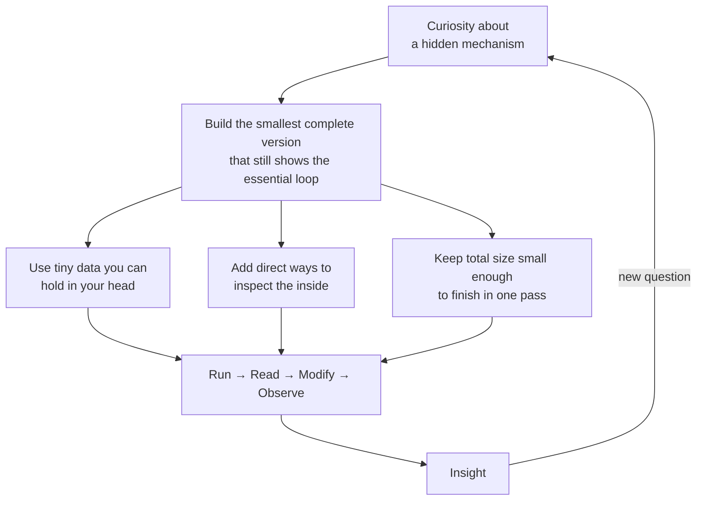

# Prototype It To Explain Itself

We build the smallest working version of an idea so the code itself teaches the idea.

Some mechanisms stay cloudy after papers, videos, or lectures. A complete, tiny, runnable prototype makes the key loop visible. You run it. You read the source. You change a number. You see what shifts. Understanding follows from contact.

## The Pattern

The loop repeats for each new prototype.

We write both the code and the docs the same way:

- Short words first.
- Active voice.
- One clear thought per sentence.
- Cut any word that does not do real work.

This matches the spirit of clear English that Orwell set out.

## Current Prototypes

- **[LLM fundamentals](llm/README.md)** — A character-level LSTM that trains on one short story and then generates new text in that style. The full next-token prediction loop fits in a few hundred lines of PyTorch. You can watch probabilities, tweak temperature, and swap the corpus.
- A thin **Predictor** abstraction (in `llm/`) plus a **Mini ReAct agent** (Think → Act → Observe with tools) built on top.
- A **Tool-Use Reliability Lab** that runs many test cases against the ReAct agent, records which tools were actually called, and produces success-rate reports.
- A **Memory** module (`memory.py`) providing short-term (recent turns) and long-term (fact retrieval) memory, with `memory_explainer.py` showing the full ReAct loop with memory injected.
- An **Agent Trajectory Evaluator** (`trajectory_evaluator.py`) that runs many ReAct episodes against a small benchmark, scores outcome/process/soundness (including a weak self-judge), and produces reports so you can see whether a change actually helps.
- A **Local Inference Playground** (`local_inference_playground.py`) that proves the Predictor seam works: the same ReAct + memory + evaluator code runs unchanged against different backends (real tiny model or simulated "local" ones) while showing live latency/quality metrics.
- A **Synthetic Data Factory** (`synthetic_data_factory.py`) that generates trajectories, filters the good ones with self-critique, turns them into training data, and can actually improve the model. The "agent improves itself" flywheel made tiny and visible.
- A **Typed Agent Workflow** (`typed_agent_workflow.py`) that models the ReAct loop with strict types and a state machine so many classes of invalid execution become impossible or explicitly rejected. Python illustration of reliability-by-construction (ideal in Rust).
- A **Human-in-the-Loop Agent Desktop** (`human_in_loop.py`) (terminal edition) that surfaces low-confidence steps, lets a human approve/edit/inject, logs every intervention, and supports different autonomy modes. The supervision patterns production agents actually need.
- A **Multi-Agent Debate / Collaboration** (`multi_agent_debate.py`) — the capstone. A tiny orchestrator spawns specialist agents, runs a critic round, and synthesizes a better answer. Composes every prior prototype through the Predictor seam.

More prototypes will live in their own folders under this root. Each one will target one mechanism that is easy to use but hard to see.

## Why Small Prototypes Beat Description Alone

- The data is small. You can see every pattern the model picks up.
- The model is small. You can trace a forward pass by hand if you want.
- The loop is complete. Tokenize → embed → process → predict → sample → append.
- Change one lever and the output changes in ways you can feel.

The gap between the toy and real systems becomes concrete instead of magical.

## How to Use This Repository

1. Choose a prototype folder.
2. Read its README for the narrow goal and the diagram.
3. Run the main script with the examples given.
4. Open the source file and follow the data as it moves.
5. Edit one constant, hyperparameter, or piece of the story. Run again.

Do this a few times and the abstract claim turns into a felt fact.

## Future Direction

We will add one prototype at a time. Each new prototype (usually under `llm/`) will contain:

- The runnable code (as small as the concept allows)
- Clear "WHAT YOU JUST SAW" educational blocks and examples
- Visual explanations (Mermaid where they help) following the project's diagram rules

**Mandatory documentation updates after every prototype:**

- Update the "Current Prototypes" list in this root README.md (one concise bullet).
- Add a dedicated section in `llm/README.md` (purpose, how it reuses prior pieces, run commands, limitations) and update the "Sequencing — What Comes Next" list.
- Update `llm/architecture.md`: the high-level layered diagram (if it affects Composition/Usage layers), the interconnections table, and any relevant runtime usage notes.
- Keep `PROTOTYPE_ROADMAP.md` status and the live todo list in sync.

The root README stays short. It links the prototypes and restates the shared intent. `llm/README.md` and `architecture.md` are the detailed living references.

## License

This is research and education code. Use it to learn, to teach, and to build the next small explainer.

---

Build the smallest thing that still carries the heart of the idea. Then let the prototype do the explaining.