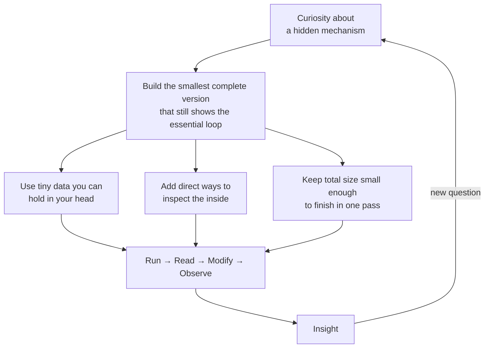

# Prototype It To Explain Itself

We build the smallest working version of an idea so the code itself teaches the idea.

Some mechanisms stay cloudy after papers, videos, or lectures. A complete, tiny, runnable prototype makes the key loop visible. You run it. You read the source. You change a number. You see what shifts. Understanding follows from contact.

## The Pattern

The loop repeats for each new prototype.

We write both the code and the docs the same way:

- Short words first.
- Active voice.
- One clear thought per sentence.
- Cut any word that does not do real work.

This matches the spirit of clear English that Orwell set out.

## Current Prototypes

- **[LLM fundamentals](llm/README.md)** — A character-level LSTM that trains on one short story and then generates new text in that style. The full next-token prediction loop fits in a few hundred lines of PyTorch. You can watch probabilities, tweak temperature, and swap the corpus.
- A thin **Predictor** abstraction (in `llm/`) plus a **Mini ReAct agent** (Think → Act → Observe with tools) built on top.
- A **Tool-Use Reliability Lab** that runs many test cases against the ReAct agent, records which tools were actually called, and produces success-rate reports.
- A **Memory** module (`memory.py`) providing short-term (recent turns) and long-term (fact retrieval) memory, with `memory_explainer.py` showing the full ReAct loop with memory injected.
- An **Agent Trajectory Evaluator** (`trajectory_evaluator.py`) that runs many ReAct episodes against a small benchmark, scores outcome/process/soundness (including a weak self-judge), and produces reports so you can see whether a change actually helps.

More prototypes will live in their own folders under this root. Each one will target one mechanism that is easy to use but hard to see.

## Why Small Prototypes Beat Description Alone

- The data is small. You can see every pattern the model picks up.
- The model is small. You can trace a forward pass by hand if you want.
- The loop is complete. Tokenize → embed → process → predict → sample → append.
- Change one lever and the output changes in ways you can feel.

The gap between the toy and real systems becomes concrete instead of magical.

## How to Use This Repository

1. Choose a prototype folder.
2. Read its README for the narrow goal and the diagram.
3. Run the main script with the examples given.
4. Open the source file and follow the data as it moves.
5. Edit one constant, hyperparameter, or piece of the story. Run again.

Do this a few times and the abstract claim turns into a felt fact.

## Future Direction

We will add one prototype at a time. Each new folder will contain:

- The runnable code (as small as the concept allows)
- A focused README with a visual diagram of the core flow
- Clear notes on what was left out and why

The root README will stay short. It links the separate prototypes and restates the shared intent.

## License

This is research and education code. Use it to learn, to teach, and to build the next small explainer.

---

Build the smallest thing that still carries the heart of the idea. Then let the prototype do the explaining.