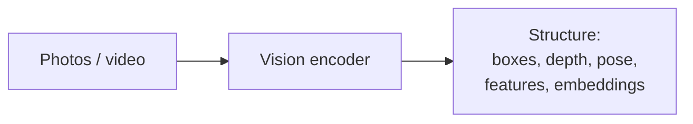

# Computer Vision: See → Structure

Classic computer vision turns pixels into edges, depth, poses, boxes, and features. Modern computer vision does the same job with learned encoders (CNNs, Vision Transformers). The output is **measurements about the world** — geometry, identity, motion — not “pretty pixels.”

## The job

## What “structure” means

- **Where** things are (boxes, masks, depth)
- **What** they are (classes, identities)
- **How** they move (tracks, optical flow)
- **How they relate** (scene graphs, embeddings you can compare)

These are facts the rest of a system can act on: planners, agents, 3D reconstructors, captioners.

## Contrast

| System | Arrow | Product |
|--------|-------|---------|
| Computer vision | pixels → meaning | measurements / embeddings |
| Diffusion | meaning or noise → pixels | new observations |
| Gaussian splatting | multi-view photos → editable 3D | a renderable scene |

Vision lifts the world into a shared space. Generators and 3D carriers put something back you can see.
