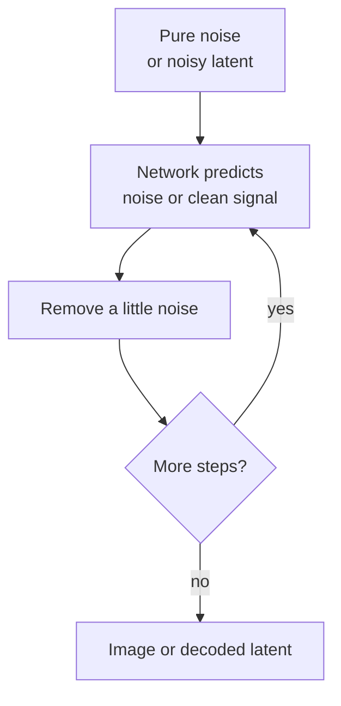

# Diffusion: Generate by Un-noising

Start from noise. A network predicts how to remove a little noise at each step. After many steps you get an image (or a latent that a decoder turns into pixels).

Training flips the story: take a real sample, add noise on a schedule, and teach the net to reverse that damage. At inference the model walks the same path backward from pure noise toward structure.

## Why this prototype shape matters

A working diffusion demo can *show* “noise → structure” as the story of generative vision. The artifact itself is the lecture: you watch order appear.

## Core loop

## Training vs inference

| Phase | Input | Job |
|-------|--------|-----|
| Train | Real sample + known noise level | Predict the noise (or the clean target) |
| Infer | Random noise + step schedule | Iteratively denoise toward a sample |

## Contrast

- **Diffusion** *makes* images (or other signals) by sampling.
- **Computer vision** *reads* images into measurements about the world.

Both often share encoders and latents; the direction of the arrow differs.
