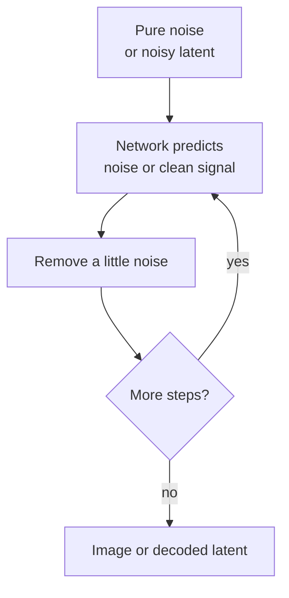

# Diffusion: Generate by Un-noising

Start from noise. A network predicts how to remove a little noise at each step. After many steps you get an image (or a latent that a decoder turns into pixels).

Training flips the story: take a real sample, add noise on a schedule, and teach the net to reverse that damage. At inference the model walks the same path backward from pure noise toward structure.

## Why this prototype shape matters

A working diffusion demo can *show* “noise → structure” as the story of generative vision. The artifact itself is the lecture: you watch order appear.

## Core loop



## Training vs inference

| Phase | Input | Job |
|-------|--------|-----|
| Train | Real sample + known noise level | Predict the noise (or the clean target) |
| Infer | Random noise + step schedule | Iteratively denoise toward a sample |

## Contrast

- **Diffusion** *makes* images (or other signals) by sampling.
- **Computer vision** *reads* images into measurements about the world.

Both often share encoders and latents; the direction of the arrow differs.

## Run

| File | What it does |
|------|----------------|
| `toy_denoise_1d.py` | 1D signal: train a tiny noise predictor, then denoise from pure noise (stdlib only) |
| `noise_to_structure.html` | 2D canvas: scrub through denoise steps in the browser |

```bash
# Terminal — watch MSE fall as structure returns
python diffusion/toy_denoise_1d.py
python diffusion/toy_denoise_1d.py --steps 40 --save diffusion/out_denoise.ppm

# Browser — open the HTML file locally (no server needed)
# Linux: xdg-open diffusion/noise_to_structure.html
# macOS: open diffusion/noise_to_structure.html
```

## WHAT YOU JUST SAW

**Training** adds known noise to a clean signal and teaches a network to predict that noise. You had the ground truth — the model learns the forward corruption.

**Inference** starts from random noise and walks backward. No clean sample is given; the network must guess what to remove at each step. That train/infer asymmetry is the heart of diffusion: learn destruction forward, perform creation backward.
