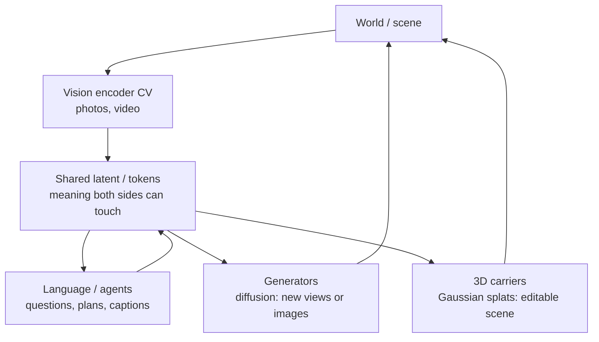

# Multimodal Spine: One World, Many Tongues

**One world state, many sensors and languages.**

Vision, text, generators, and 3D carriers meet in a shared latent (or token) space. Questions in language can move geometry or pixels because they land in the same place the vision encoder wrote into.

## Map

## Roles

- **CV** lifts pixels into the shared space.
- **Language** (and other modalities) lands in the same space so a question like “what’s behind the chair?” can drive geometry or pixels.
- **Diffusion** samples *new* observations consistent with the latent.
- **Splatting** stores a *persistent, renderable* 3D explanation you can walk around — a prototype that explains itself by being the scene.

## One sentence

**See (CV) → bind (multimodal latent) → show (diffusion or splats) so the artifact teaches the idea without a lecture.**
