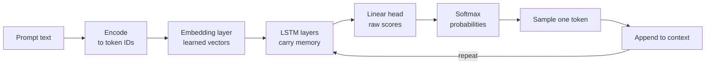
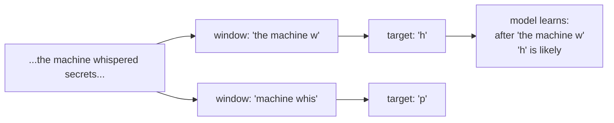

# LLM Prototype

This folder holds a tiny, complete language model. It exists so you can see how text generation works from the inside.

The model has only ~150k parameters. Real models have billions. The goal is not power. The goal is clarity.

## The One Big Idea

Every large language model does the same core job:

> Look at the text so far. Predict the next token. Append it. Repeat.

That loop, scaled up, produces fluent writing, code, and reasoning.

This prototype makes that loop visible and runnable.

## How Text Flows During Generation



The model never plans the whole reply at once. At every step it only chooses what comes next.

## Training Teaches the Guesses

We turn the story into many short examples by sliding a window across it.



Each training step asks only one question: given these characters, what comes next? The model sees thousands of such questions from the repeated story.

We repeat one short story 15 times. The model overfits on purpose. It learns the names, the rhythm, and the world of that story.

## The Main Parts

1. **Data** — One story, repeated. See `STORY` and `CORPUS`.
2. **Tokenizer** — Characters only. About 50 symbols. Real systems use subword tokens (30k–100k).
3. **Dataset** — Sliding windows that create (context, next-char) pairs.
4. **Model** — Embedding → 2-layer LSTM → Linear prediction head.
5. **Training** — AdamW optimizer. Loss only on the single next character.
6. **Generation** — The autoregressive loop with temperature control.
7. **Inspection** — `--show-probs` shows the model's top guesses for the next character.

The script runs all of these steps in order when you execute it.

## Run It

From the project root:

```bash
python llm/simple_llm_prototype.py
```

Useful variants:

```bash
python llm/simple_llm_prototype.py --prompt "Elara dreamed of" --tokens 180 --temp 0.6
python llm/simple_llm_prototype.py --show-probs
```

See the module docstring in `simple_llm_prototype.py` for every flag and example.

## What We Left Out (on purpose)

| Real LLMs                     | This Version               | Reason for the cut                     |
|-------------------------------|----------------------------|----------------------------------------|
| Subword tokenization (BPE)    | Character level            | Characters are simple to watch and debug |
| Transformer blocks + attention| 2-layer LSTM               | LSTM state is easier to follow step by step |
| Billions to trillions of params | ~150k parameters         | Small enough that one person can read it all |
| Internet-scale training data  | One story repeated 15×     | You can hold the whole set in your head |
| Long training runs            | 25 short epochs            | Fast edit-run-inspect cycle            |

The central act stays identical: predict, append, repeat.

## Experiments That Teach

- Change the `STORY` text. Retrain. Notice how the generated voice changes.
- Set `--temp 0.3` (safe) vs `--temp 1.3` (wild).
- Use `--show-probs` and watch how the ending context shifts the probabilities.
- Increase `hidden_dim` or `num_layers` in the model and measure the effect.

## This Prototype Fits a Larger Pattern

This is one working example of the "prototype it to explain itself" method.

See the [main README](../README.md) for the intent behind the whole collection and the plan for more prototypes.

---

Run it. Read every line. Change one thing. Run it again. The mechanism stops being abstract.