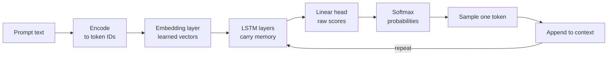
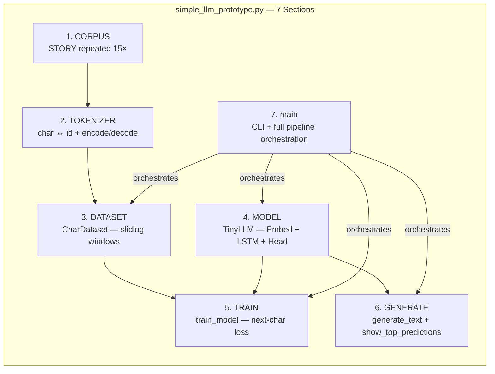
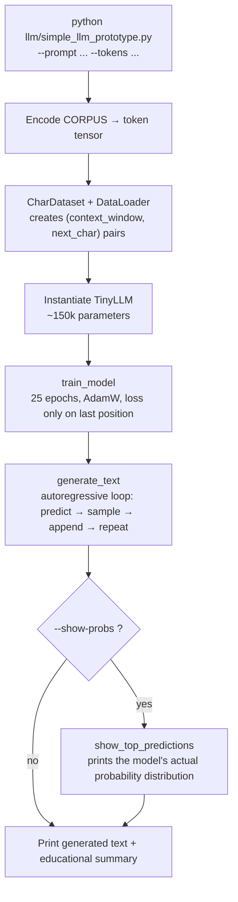
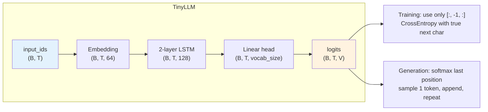
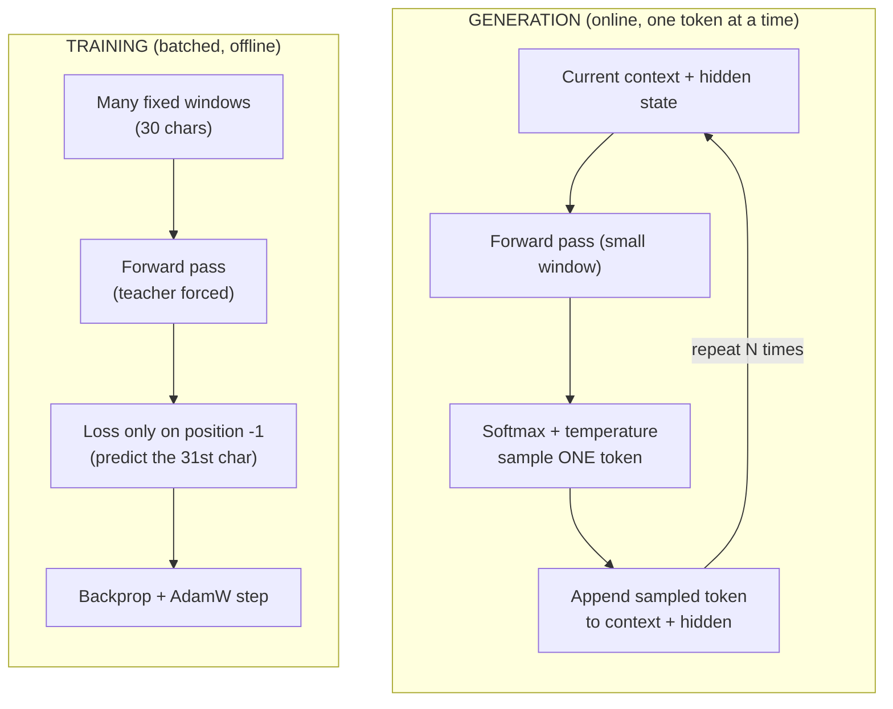
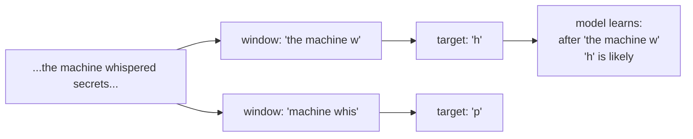

# LLM Prototype

This folder holds a tiny, complete language model. It exists so you can see how text generation works from the inside.

The model has only ~150k parameters. Real models have billions. The goal is not power. The goal is clarity.

## The One Big Idea

Every large language model does the same core job:

> Look at the text so far. Predict the next token. Append it. Repeat.

That loop, scaled up, produces fluent writing, code, and reasoning.

This prototype makes that loop visible and runnable.

## How Text Flows During Generation



The model never plans the whole reply at once. At every step it only chooses what comes next.

## Code Structure & Big-Picture Flow

The entire prototype lives in one file, deliberately. The numbered sections below map directly to the code.



### Runtime Execution Flow (what happens when you run the script)



### Model Architecture (with shapes)



### Training vs Generation (the same model, two very different loops)



These diagrams show the *structure of the code* and how data moves, not just the abstract idea. The source is intentionally small so you can hold the whole picture in your head while reading any one section.

## Training Teaches the Guesses

We turn the story into many short examples by sliding a window across it.



Each training step asks only one question: given these characters, what comes next? The model sees thousands of such questions from the repeated story.

We repeat one short story 15 times. The model overfits on purpose. It learns the names, the rhythm, and the world of that story.

## The Main Parts

1. **Data** — One story, repeated. See `STORY` and `CORPUS`.
2. **Tokenizer** — Characters only. About 50 symbols. Real systems use subword tokens (30k–100k).
3. **Dataset** — Sliding windows that create (context, next-char) pairs.
4. **Model** — Embedding → 2-layer LSTM → Linear prediction head.
5. **Training** — AdamW optimizer. Loss only on the single next character.
6. **Generation** — The autoregressive loop with temperature + (future) top-p / top-k sampling control. See [sampling-strategies.md](sampling-strategies.md).
7. **Inspection** — `--show-probs` shows the model's top guesses for the next character.

The script runs all of these steps in order when you execute it.

## Run It

From the project root:

```bash
python llm/simple_llm_prototype.py
```

Useful variants:

```bash
python llm/simple_llm_prototype.py --prompt "Elara dreamed of" --tokens 180 --temp 0.6
python llm/simple_llm_prototype.py --show-probs
```

See the module docstring in `simple_llm_prototype.py` for every flag and example.

## What We Left Out (on purpose)

| Real LLMs                     | This Version               | Reason for the cut                     |
|-------------------------------|----------------------------|----------------------------------------|
| Subword tokenization (BPE)    | Character level            | Characters are simple to watch and debug |
| Transformer blocks + attention| 2-layer LSTM               | LSTM state is easier to follow step by step |
| Billions to trillions of params | ~150k parameters         | Small enough that one person can read it all |
| Internet-scale training data  | One story repeated 15×     | You can hold the whole set in your head |
| Long training runs            | 25 short epochs            | Fast edit-run-inspect cycle            |

The central act stays identical: predict, append, repeat.

## Experiments That Teach

- Change the `STORY` text. Retrain. Notice how the generated voice changes.
- Set `--temp 0.3` (safe) vs `--temp 1.3` (wild).
- Use `--show-probs` and watch how the ending context shifts the probabilities.
- Increase `hidden_dim` or `num_layers` in the model and measure the effect.

For a deeper look at **why temperature alone is not enough** and how production systems (including Grok) actually control generation, read [sampling-strategies.md](sampling-strategies.md). It covers Top-k and Top-p (nucleus) sampling with examples that map directly to the code in `generate_text`.

## From Next-Token to Agent: The Mini ReAct Loop

The original prototype shows the heart of every LLM: predict one token, append it, repeat.

The next natural question is: "How do we turn that predictor into something that can *use tools* and solve tasks?"

**ReAct** (Reason + Act) is one of the simplest and most effective patterns.

It is not a bigger model. It is a small control loop:

1. The predictor receives a prompt that contains the goal + tool descriptions + what has happened so far.
2. It generates more text ("Thought: ...").
3. The loop looks for a structured request ("Action: calc[2+3]").
4. If found, the real Python tool runs and the result is appended as "Observation: ...".
5. The growing history goes back into the next prompt.
6. Repeat until the model writes "Final: ...".

The LLM is still only doing next-token prediction. The *agent* is the Python code that orchestrates the loop, calls tools, and manages the trajectory.

### Visual: ReAct Loop over the Predictor

```mermaid
flowchart TD
    Q[Question for Elara] --> P[Build prompt:<br/>tools + history + "Thought:"]
    P --> Pred["Predictor<br/>(tiny_predictor.py)"]
    Pred --> Gen["TinyLLM generate_text<br/>(the same brain)"]
    Gen --> Parse{Parse?}
    Parse -->|Action: name[args]| Exec[Execute real Tool<br/>(calc, lookup...)]
    Exec --> Obs["Observation: result"]
    Obs --> Hist[Append to trajectory]
    Parse -->|Final: answer| Done[Return answer]
    Hist --> P
    Parse -->|no clear action| Hist
```

The Predictor is the narrow reusable seam (see `tiny_predictor.py`). Everything above it (the loop, the tools, later memory and evaluators) only sees "text in → text out".

### Run the New Prototypes

```bash
# The predictor abstraction itself (tiny)
python llm/tiny_predictor.py   # (mostly docs + example factory)

# The actual ReAct agent
python llm/mini_react.py
python llm/mini_react.py \
  --question "How can Elara measure the power of the glowing crystals?" \
  --max-steps 6 \
  --temp 0.65
```

Both files live next to `simple_llm_prototype.py` and import from it. The training story, the Elara universe, and the generation primitive are all reused — no duplication of concepts.

### What the Trace Looks Like (example)

```
=== STEP 2 ===
Model thought / decided:
The crystals glow when the machine is near. I should calculate how much
energy they might hold if we assume each one gives a small spark.
Action: calc[3 * 4 + 2]

Action parsed: calc[3 * 4 + 2]
Observation: 14.0
```

The loop is visible. The model's creativity (or lack of perfect formatting) is also visible. This is intentional.

### Sequencing — What Comes Next

We keep every new prototype small by adding **one** clear idea on top of what already exists:

1. **Mini ReAct** (this) — the control loop + the Predictor abstraction.
2. **Tool-Use Reliability Lab** — run the same ReAct + tools many times and measure how often parsing and tool use succeed.
3. **Memory** — a tiny `memory.py` that the ReAct trajectory can query.
4. **Trajectory Evaluator** — score many runs, produce reports, use the tiny model itself as a weak judge.

Later steps deliberately choose different languages/stacks when they teach the concept better and match real production usage (Rust for typed/verifiable workflows, GUI stacks for human oversight, mixed backends for local inference, etc.). The Predictor is the place where language boundaries become possible.

See the approved plan and the todo list for the full prioritized sequence.

## This Prototype Fits a Larger Pattern

This is one working example of the "prototype it to explain itself" method.

See the [main README](../README.md) for the intent behind the whole collection and the plan for more prototypes.

---

Run it. Read every line. Change one thing. Run it again. The mechanism stops being abstract.