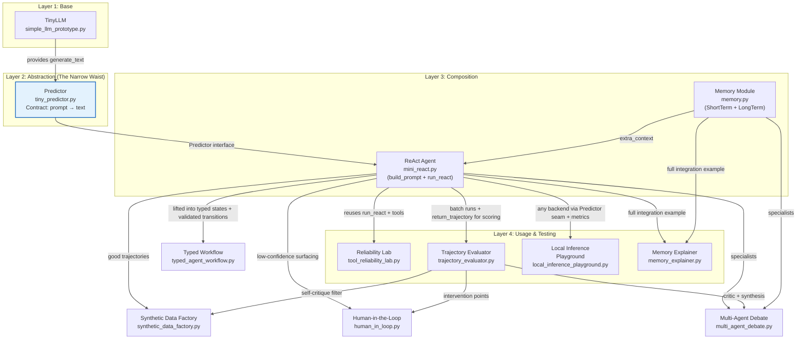
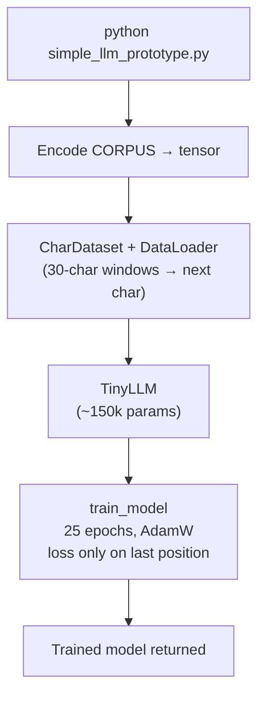
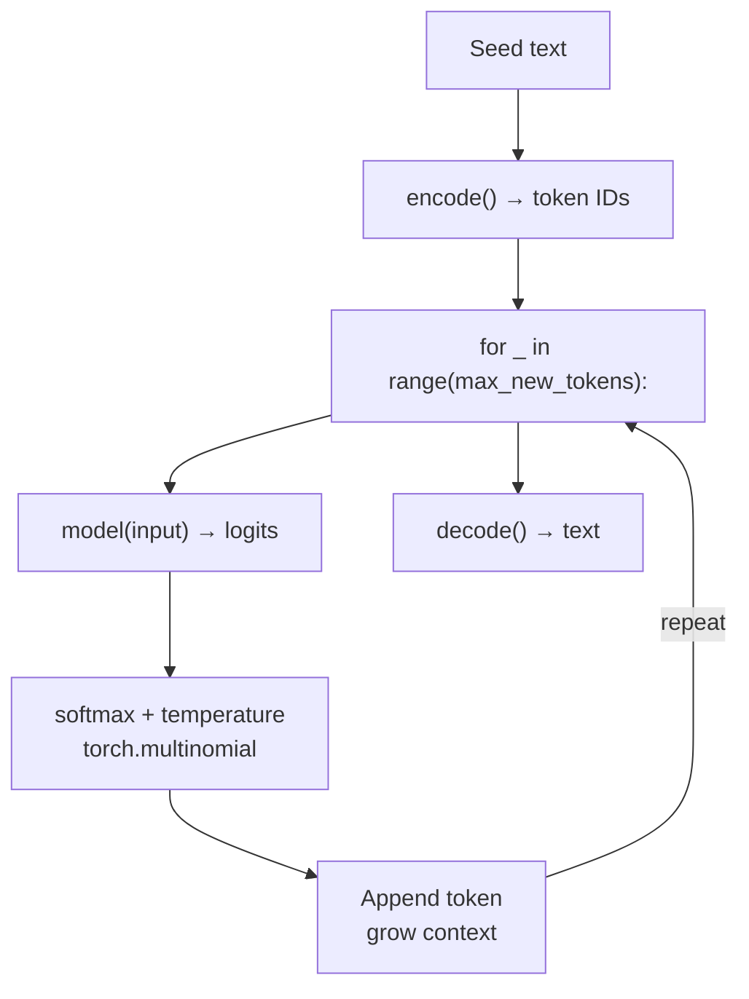
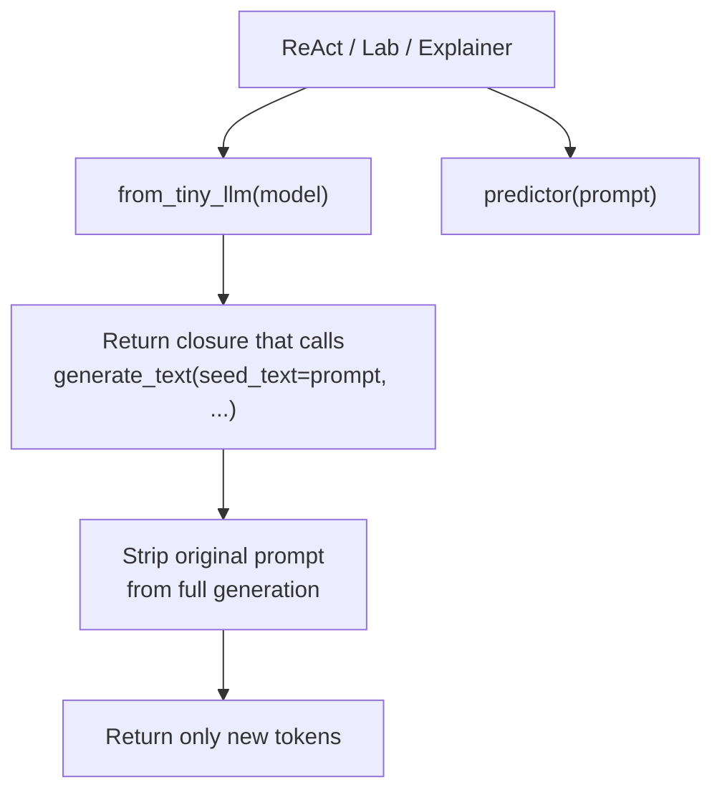
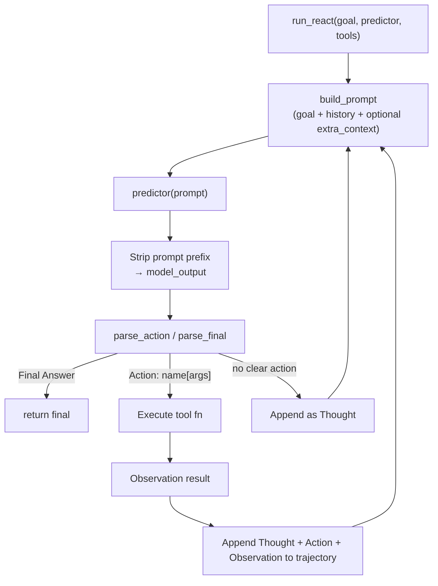
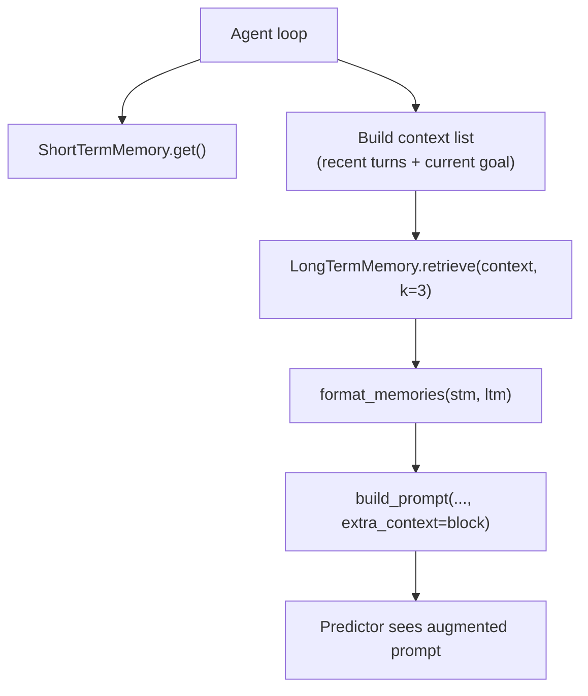
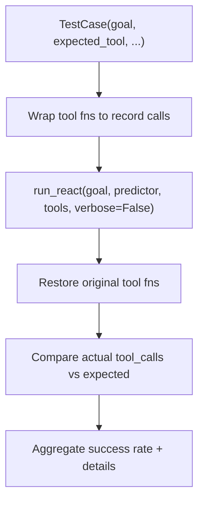
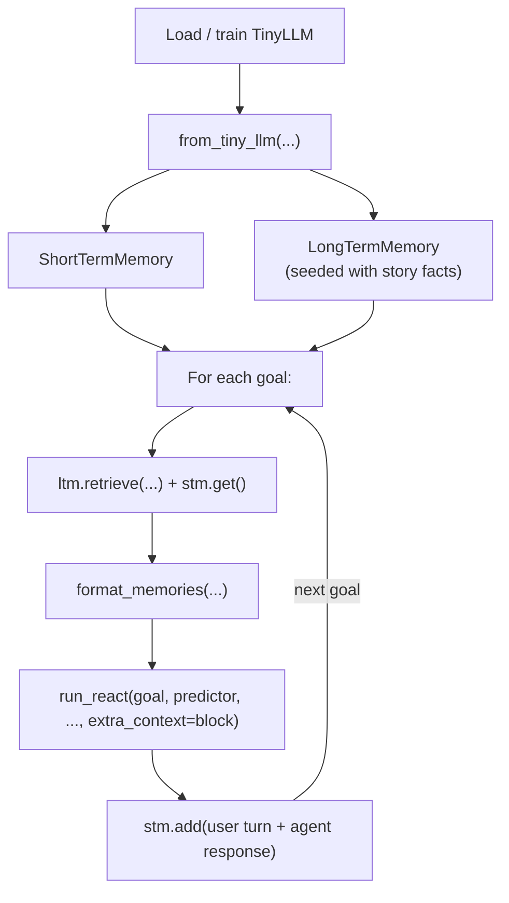

# Architecture

This document describes the overall architecture of the LLM prototype collection in the `llm/` directory.

The design follows a **layered, composable** approach:

- The base is a tiny "next-token predictor" (educational only).
- A minimal `Predictor` abstraction acts as the **narrow waist** (the stable interface).
- Higher-level concepts (agent loop, memory, testing) are built on top by **composition**, not by modifying the base.
- Everything is kept small and self-contained so the control flow is visible in one pass.

**Mermaid diagram rules (enforced to avoid recurring GitHub render failures):**
- Always start with `flowchart TD` (or LR when horizontal makes more sense).
- Nodes that need `<br/>`, special chars, or long text: use `["text here"]` or `["multi<br/>line"]`.
- **Edge labels containing `[`, `]`, `:`, or other punctuation must be double-quoted**:  
  `-->|"Action: name[args]"|`  (not `-->|Action name[args]|`).
- Keep `subgraph` and `classDef` usage minimal and only for the high-level overview. Per-module control flows stay as flat basic graphs.
- No exotic shapes, unicode arrows, or heavy styling — GitHub's Mermaid renderer is fragile.

These rules come from repeated pain fixing the exact same "SQS" / bracket-in-label parse errors.

**Documentation rule:** After landing any new prototype, always update:
- Root `README.md` "Current Prototypes" list (one bullet).
- `llm/README.md` (new section + Sequencing list).
- This file (`architecture.md`): layered diagram + interconnections table + usage notes.
- `PROTOTYPE_ROADMAP.md` status.

The project now also maintains a hosted **Reflect and Attempt Quizz** (`reflect-and-attempt-quizz.html`) and **Reference Site** (Astro-powered) under the Cloudflare Pages project `prototype-it-to-explain-itself`. New work should consider whether the architecture diagram or interconnections need corresponding updates in the hosted docs.

This keeps the collection self-explanatory as it grows.

## High-Level Overview: How Everything Is Connected

This single diagram shows the full architecture and interconnections between all core modules.




### Key Connections Explained

- **TinyLLM → Predictor**: `tiny_predictor.py` wraps `generate_text` from the base prototype. All higher code talks only to the `Predictor` callable.
- **Memory → ReAct**: `memory.py` produces a text block via `format_memories(...)`. This is passed as `extra_context` into `build_prompt(...)` inside `mini_react.py`.
- **ReAct → Lab & Explainer**: Both the reliability lab and the memory explainer import and drive `run_react` (the lab runs it silently for measurement; the explainer runs it verbosely to demonstrate memory injection).
- **The Predictor is the seam**: This is the most important architectural decision. It lets us keep the base LLM teaching tool pure while allowing new prototypes (and future real backends) to compose on top without touching tokenization or training code.

This diagram + the per-module control flows below give a complete picture of the system.

Key principle: **Higher layers only talk to the `Predictor` contract** (`prompt: str → str`). They never directly touch `TinyLLM`, tokenization, or training logic. This makes swapping the "brain" (future Ollama, MLX, etc.) straightforward.

---

## 1. TinyLLM Base (`simple_llm_prototype.py`)

**Purpose**: Teach the fundamental "predict next token, append, repeat" loop using the smallest possible complete implementation.

**Structure** (deliberately one file with numbered sections):

1. Corpus (STORY repeated)
2. Tokenizer (char-level `encode` / `decode`)
3. Dataset (`CharDataset` — sliding windows)
4. Model (`TinyLLM` — Embedding + LSTM + Linear head)
5. Training (`train_model`)
6. Generation (`generate_text` + `show_top_predictions`)
7. CLI entry point

**Control Flow — Training**




**Control Flow — Generation (Autoregressive)**




**Key Interconnections**:

- Tokenizer globals (`char2idx`, `idx2char`, `encode`, `decode`) are imported by `mini_react.py` and `tiny_predictor.py`.
- `generate_text` is the primitive wrapped by the Predictor.

---

## 2. Predictor Abstraction (`tiny_predictor.py`)

**Purpose**: The **narrow waist** / stable contract for all higher-level prototypes.

Contract:

```python
Predictor = Callable[[str, Optional[int]], str]   # prompt, max_new_tokens → completion
```

**Factory**:

```python
def from_tiny_llm(model, temperature=0.8, device="cpu", ...) -> Predictor
```

**Control Flow**




**Why it exists**:

- `simple_llm_prototype.py` stays a pure teaching tool (no bloat).
- Swapping the underlying model (Ollama, etc.) only requires a new factory.
- All agent logic stays identical.

---

## 3. ReAct Agent (`mini_react.py`)

**Purpose**: Demonstrate the classic ReAct (Reason + Act) control loop on top of the Predictor.

**Structure**:

- Tools (`@dataclass Tool` + `tool_calc`, `tool_lookup`)
- Prompt builder (`build_prompt` — supports `extra_context`)
- Parser (`parse_action`, `parse_final` — intentionally naive regex)
- Core loop (`run_react`)
- Training + model loading (reuses `simple_llm_prototype` pieces)
- Verbose trace with `[AGENT]` / `[MODEL]` labels

**Control Flow — One ReAct Step**




**Key Design Notes**:

- `build_prompt` accepts `extra_context` so memory (or anything) can be injected without changing the ReAct loop.
- A temporary "forcing" path exists when the question itself is written in `tool[args]` syntax (for demo purposes with the weak model).
- Verbose mode prints the exact prompt tail the model sees and the raw model output (`repr`).

---

## 4. Memory Module (`memory.py`)

**Purpose**: Show how to add short-term + long-term memory that can be queried and injected into the agent's prompt.

**Structure**:

- `ShortTermMemory` — `deque` with fixed `window`
- `LongTermMemory` — list of facts + `retrieve(context, k)` using simple word-overlap scoring
- `format_memories(short, long)` → prompt-ready string
- Self-test at bottom

**Control Flow — Retrieval + Injection**




**Integration Point**:

```python
memory_block = format_memories(stm.get(), ltm.retrieve(...))
prompt = build_prompt(question, tools, trajectory, extra_context=memory_block)
```

---

## 5. Reliability Lab (`tool_reliability_lab.py`)

**Purpose**: Turn the ReAct agent into a measurable system. Quantify how often it actually succeeds at using tools correctly.

**Structure**:

- `TestCase` dataclass (goal, expected_tool, expected_arg_contains, category)
- `evaluate_case`: temporarily wraps tool functions to record calls, runs `run_react(verbose=False)`, restores, scores.
- `main`: runs suite, prints report + per-category stats.

**Control Flow — One Test Case**




**Important**: Because the underlying model is weak, many "direct" cases in the lab use the action syntax so that the forcing logic ensures a tool is actually invoked. This allows the lab to measure *correct tool selection and args* rather than just "did the model produce the format?"

---

## 6. Memory Explainer (`memory_explainer.py`)

**Purpose**: Concrete, runnable example that composes **everything** together (model + Predictor + ReAct + Memory) and makes the full loop visible.

**High-Level Flow**




It uses `verbose=True` so you can see:

- The exact prompt tail (including injected memory)
- Raw model output
- Whether a tool was called (via forcing or real generation)
- How short-term memory accumulates across goals

---

## Interconnections Summary


| Module                 | Imports From                        | Exposes To                     |
| ---------------------- | ----------------------------------- | ------------------------------ |
| `simple_llm_prototype` | (self-contained)                    | `mini_react`, `tiny_predictor` |
| `tiny_predictor`       | `simple_llm_prototype`              | All higher layers              |
| `mini_react`           | `simple...` + `tiny_predictor`      | Lab, Explainer, future agents  |
| `memory`               | (self-contained)                    | Explainer (and any agent)      |
| `tool_reliability_lab`     | `mini_react` + `tiny...`            | (standalone)                   |
| `trajectory_evaluator`       | `mini_react` + `tiny...`               | (standalone)                   |
| `local_inference_playground` | `mini_react` + `tiny...` (any backend) | (standalone)                   |
| `synthetic_data_factory`     | `mini_react` + Evaluator + Predictor   | (data + optional training)     |
| `typed_agent_workflow`       | `mini_react` + Predictor (typed lift)  | (typed safety layer)           |
| `human_in_loop`              | `mini_react` + Evaluator               | (oversight / intervention)     |
| `multi_agent_debate`         | `mini_react` + Evaluator + Memory      | (orchestrator + specialists)   |
| `memory_explainer`           | `mini_react` + `memory` + `tiny...`    | (explainer)                    |


The **Predictor** is the only stable boundary. Everything else is free to evolve.

---

This architecture deliberately trades model power for **visibility**. Every control flow decision, prompt construction step, and tool invocation is observable in the verbose traces or the lab reports.