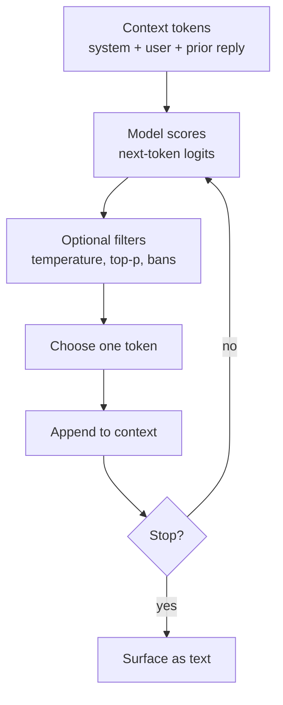

# NLP Coherence and Style: How LLMs Form Sentences

Large language models do not assemble sentences from a grammar textbook. They extend a token sequence one piece at a time. Coherence is what you get when each next piece fits the pattern the model learned from vast text — and when later training and prompting steer which patterns win.

This page is the language twin of the vision spine: **bind meaning in a shared space, then show it as readable words.**

## 1. How output coheres

### Tokens, not “words only”

Text is cut into **tokens** (subwords, punctuation, sometimes whole words). The model’s vocabulary is that token set. Generation is: given the tokens so far, score every next token, then sample or pick.

### Autoregressive loop



Each step conditions on **everything already written** in the window (and on tools/results if the product injects them). Local grammar, topic continuity, and “sounding like a reply” emerge because those patterns were common and rewarded in training — not because a separate syntax module ran first.

### Attention as glue

Inside the network, **attention** lets each new token look back at earlier ones (and, in some designs, at other modalities). That is the main coherence mechanism: “the pronoun refers to…”, “this clause continues the list…”, “this answer should match the question’s constraints…”.

### NLP stack under the hood (compressed)

| Layer | Job |
|-------|-----|
| Tokenization | Text ↔ discrete ids |
| Embedding | Ids → vectors |
| Transformer blocks | Contextualize via attention + feed-forward |
| LM head | Vectors → next-token scores |
| Decoding policy | Scores → chosen token (greedy, sample, beam, …) |

Classic NLP (parsers, taggers, entity linkers) still appears in products as **tools** or **evals**. The fluent surface of a chat model is mostly the generative loop above.

## 2. How a sentence actually forms

1. **Prompt packing** — system rules, user text, few-shot examples, and prior turns become one token stream.
2. **Left-to-right commitment** — once a token is chosen, later tokens must live with it (unless the product rewrites or regenerates).
3. **Distributional grammar** — subject–verb agreement, clause shape, and register appear because alternatives scored lower under this context.
4. **Discourse habits** — openings, hedging, lists, and closings reflect post-training preferences as much as raw pretraining.
5. **Stop** — end-of-sequence, max length, or a product rule ends the loop; the detokenizer turns ids back into characters.

So “sentence making” is **sequential decision-making under a learned distribution**, shaped by decoding settings and by whatever the product put in the prompt.

## 3. Why frontier labs sound different

Same broad architecture family; different **data, objectives, and product defaults**.

| Lever | What it changes |
|-------|-----------------|
| **Pretraining mix** | Topics, languages, code vs prose, citation habits |
| **Tokenizer** | Word splits, multilingual behavior, “weird” spacing |
| **Supervised fine-tune (SFT)** | Task formats, helpfulness templates, refusal shape |
| **Preference / RL stage** (RLHF, RLAIF, DPO, …) | What “good” answers feel like: warmth, caution, length, humor |
| **System / developer prompts** | Standing voice the user never sees |
| **Safety and policy layers** | What gets refused, rewritten, or softened |
| **Decoding defaults** | Temperature, top-p, repetition penalties → dry vs lively |
| **Tool and retrieval wiring** | Whether answers cite, browse, or stay closed-book |

Labs optimize for different product goals (assistant, search companion, coding agent, uncensored research). Those goals show up as **word choice, sentence length, hedging, emoji habits, and structure** — not as a separate “style neural net” you can point to.

Two models can share an architecture paper and still diverge because their **preference data and system prompts** disagree about what a good paragraph is.

## 4. How you ask for a specific style

Style is steered most reliably by **clear constraints + examples**, not by a single adjective.

### Put the voice in the standing instructions

- Role: “You are a terse staff engineer writing for skimmers.”
- Register: “Plain words. Contractions. No corporate filler.”
- Shape: “Lead with the answer. Max two short paragraphs unless I ask for steps.”
- Negatives: “Do not open with Certainly. Do not use bulleted lists unless I ask.”

Standing system/custom instructions beat repeating the same plea every turn.

### Show, don’t only name

Few-shot beats vibe words:

- Paste 3–5 lines that sound right and say “Match this voice.”
- Or paste a bad line and say “Never sound like this.”

Named styles (“like a BBC explainer”, “like a commit message”) work when the model has seen that genre; **examples** lock the grain.

### Control knobs that are not “prompt poetry”

| Ask for… | Example |
|----------|---------|
| Length | “Five sentences.” / “One screen, no scroll.” |
| Structure | “Claim, then evidence, then risk.” |
| Audience | “Reader knows git, not ML.” |
| Formality | “Board memo” vs “Slack to a teammate” |
| Dialect / language | “Swedish with technical terms in English” |
| Sampling | Lower temperature for tighter, more repetitive-safe prose |

### Multimodal and agent products

When tools run, style instructions still apply to the **final wording**, but facts should follow tool results. Say so: “Keep this voice; prefer tool output over memory for numbers.”

## 5. Tie-back to the prototype pattern

The tiny LSTM in this repo already shows the core: **next-token prediction + sampling**. Production labs add scale, preference training, and product prompts. The mechanism you can hold in your head stays the same: each token is a bet on what should come next under this context.

**See (read the prompt) → bind (latent/context) → show (decoded tokens) so the reply teaches the idea — or the voice — without a lecture about the model.**

## Run

| File | What it does |
|------|----------------|
| `style_sampler.py` | Bigram next-token loop with temperature + top-p; two corpora (`warm` / `terse`) |
| `token_sampler.html` | Same decoding knobs in the browser (character bigram) |

```bash
# Decoding policy only — no torch, no training loop
python nlp/style_sampler.py
python nlp/style_sampler.py --corpus terse --prompt "State" --temp 0.4
python nlp/style_sampler.py --compare-temp

# Browser
# Linux: xdg-open nlp/token_sampler.html
```

**Full train + generate (LSTM, embeddings, loss):** [`llm/simple_llm_prototype.py`](../llm/simple_llm_prototype.py) and [`llm/README.md`](../llm/README.md).

## WHAT YOU JUST SAW

Each token was chosen **left to right** from a distribution shaped by prior tokens. Temperature flattened or sharpened that distribution; top-p cut the long tail. Switch corpus (`warm` vs `terse`) and the same mechanism sounds different — style lives in the data and the decoding knobs, not a separate grammar engine.

For the full loop (tokenize → embed → predict → sample → append), use the LSTM prototype in `llm/`.
