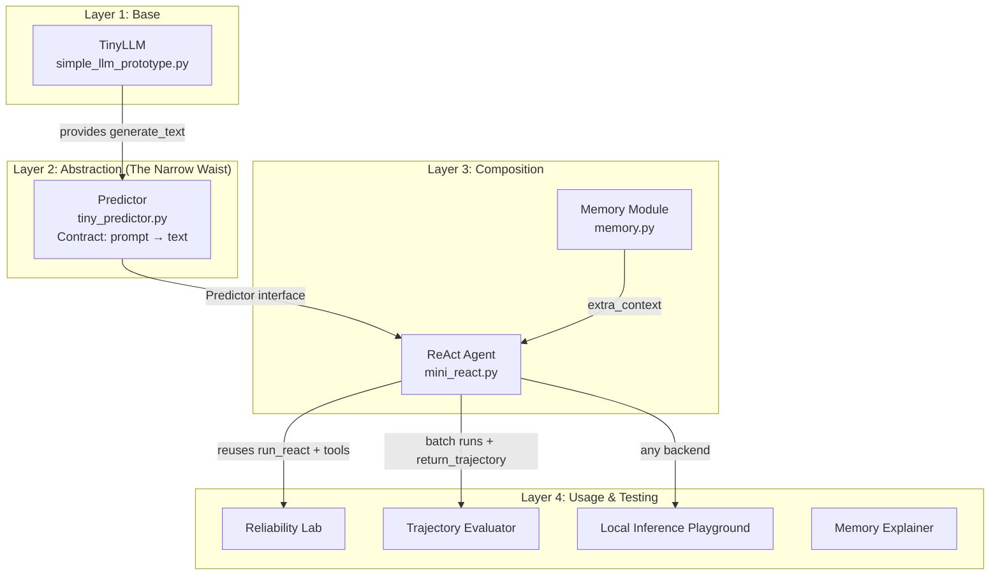

import PracticeCTA from '../../components/PracticeCTA.astro';

# Architecture & the Predictor Seam

This is the technical heart of the project.

The design follows a **layered, composable** approach:

- The base is a tiny "next-token predictor" (educational only).
- A minimal `Predictor` abstraction acts as the **narrow waist** (the stable interface).
- Higher-level concepts (agent loop, memory, testing) are built on top by **composition**, not by modifying the base.

## The High-Level Picture

The **Predictor** is the only stable boundary. Everything above it (ReAct, memory, evaluators, multi-agent, human oversight...) only ever talks to `prompt: str → str`.

<PracticeCTA concept="predictor-narrow-waist" label="Test your understanding of the Predictor seam" />

## Why the narrow waist matters

Because the contract is tiny and stable, we can:

- Keep the base `simple_llm_prototype.py` pure as a teaching tool.
- Swap the underlying brain (tiny LSTM → real local models) without touching a single line of agent code.
- Later move pieces to Rust, Go, etc. while the higher-level logic stays the same.

This is the same principle that let us add memory, the reliability lab, synthetic data, typed workflows, human-in-the-loop, and multi-agent collaboration without ever bloating the original prototype.

<PracticeCTA concept="why-not-bloat-base" label="Why we refuse to bloat the base prototype" />
